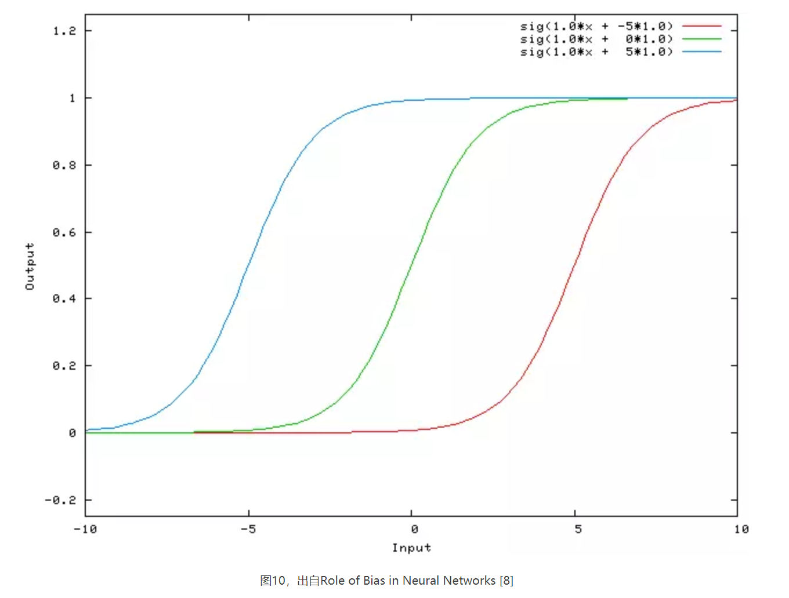
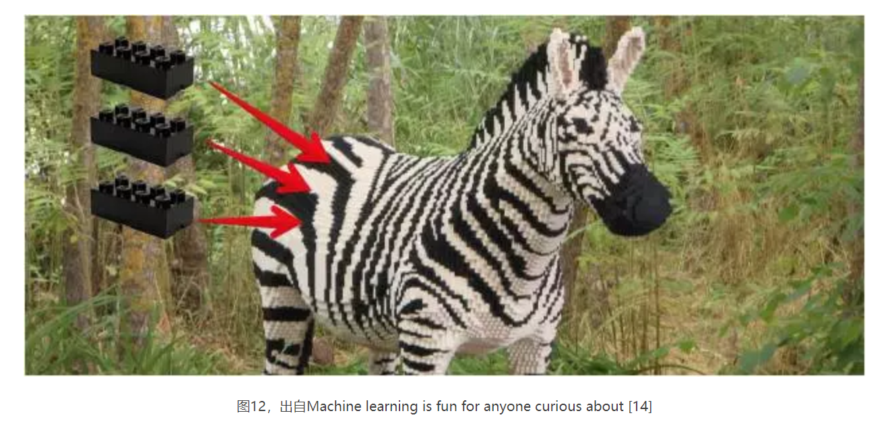
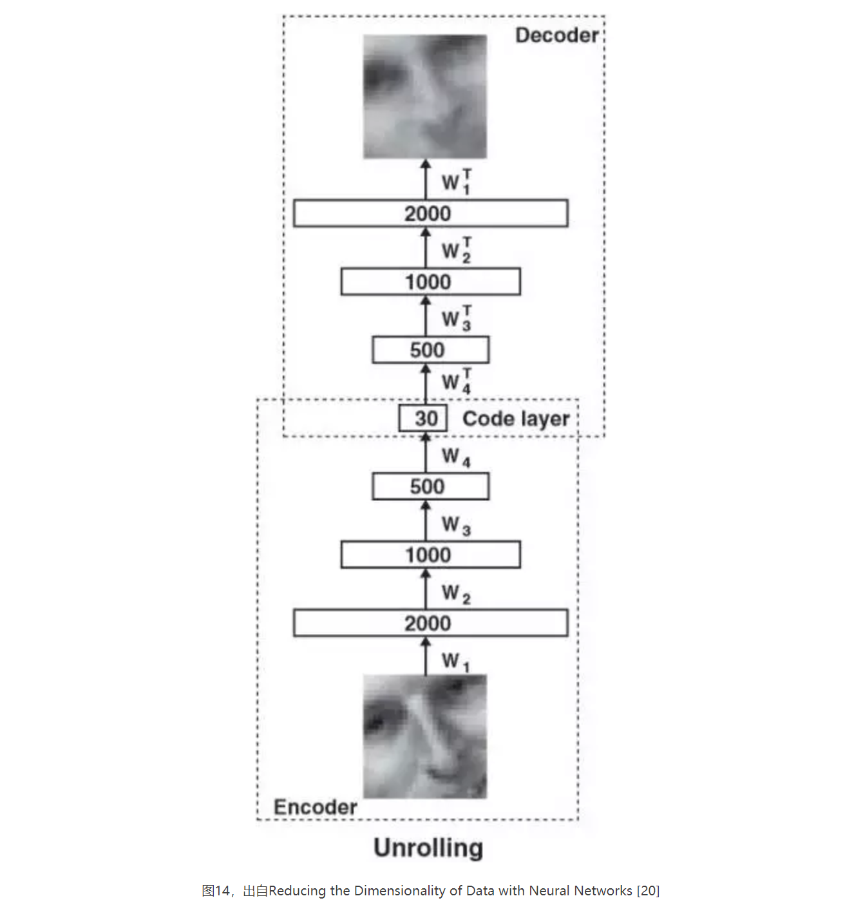
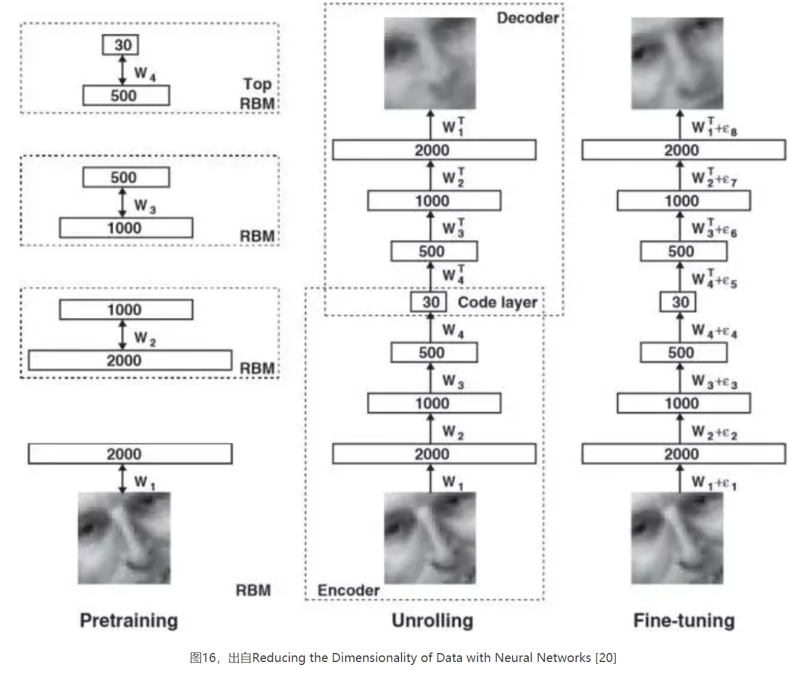
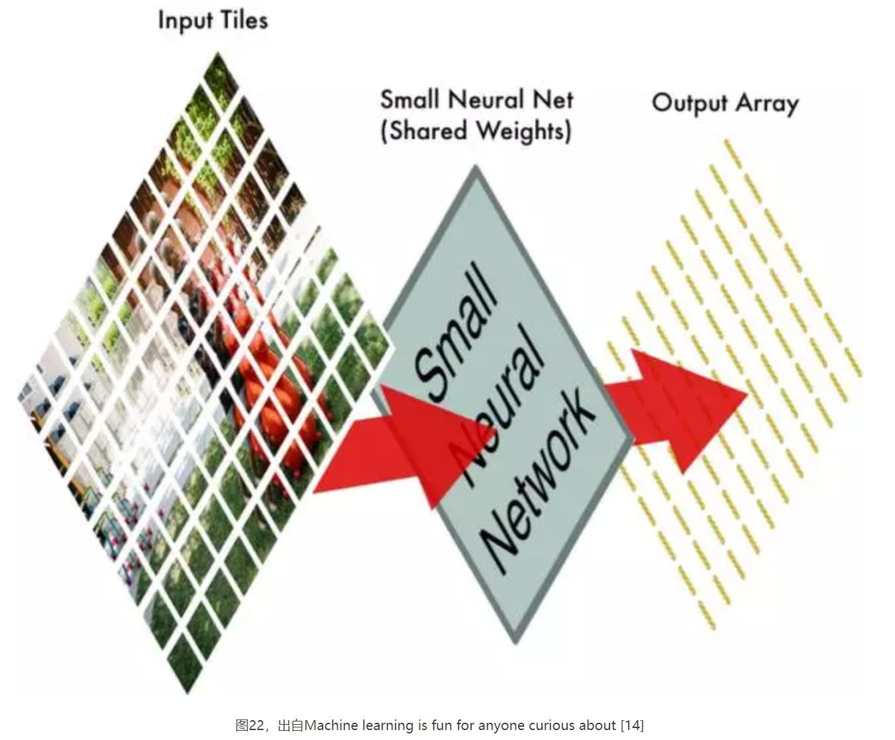

### 目录
> ##### 1. 神经元与前馈神经网络
> ##### 2. 反向传播算法与梯度下降
> ##### 3. 自动编码器、受限玻尔兹曼机与深度学习
> ##### 4. 卷积神经网络及其它

### 1. 神经元与前馈神经网络

人工神经网络是人类仿照生物神经网络的工作方式设计的计算模型。神经元（Neuron）是神经网络的基本单元，也称节点（Node），它从外部或其它节点收到输入（Input），并通过一个激活函数（Activation Function）来计算输出（Output）；每一个输入都对应权重（Weight），即这个节点收到的每一个输入的相对重要性；偏置（Bias）可以理解为一种特殊的输入。

上图是一个神经元，它有输入x1和x2，对应的权重值分别为w1和w2，以及值为1的偏置，对应的权重值为b；这个节点通过激活函数f计算出输出y。常见的激活函数包括：阈值函数（Threshold Function）、S型函数（Sigmoid Function）、双曲正切函数（Hyperbolic Tangent Function）、修正线性单元（Rectified Linear Unit）、Maxout函数；可以通过本文的参考文献进一步了解。

逐层排列的节点构成前馈神经网络（Feedforward Neural Network），每一层中的每一个节点连接下一层中的每一个节点，同一层中的节点之间没有连接，并且初始来自外部世界的输入只会朝向输出层做单向传递，而不会构成循环；前馈神经网络分为单层感知器（Single Layer Perceptron）和多层感知器（Multi-Layer Perceptron）两种。

单层感知器由一个输入层（Input Layer）和一个输出层（Output Layer）构成，输入层中的每一个输入节点将其从外部收到的输入提供给输出层中的每一个输出节点；输出节点在计算输出的过程中，对每一个收到的输入都会按照其对应的权重进行调整。

多层感知器由一个输入层、一个输出层和中间的一个或多个隐藏层（Hidden Layer）构成；图6是只有一个隐藏层的多层感知器，其中偏置只能看做一种输入；隐藏层中的隐藏节点与外部世界没有直接联系。传统的机器学习大多基于单层感知器，或者至多有一个隐藏层；而要实现深度架构，需要包含超过一个隐藏层。

图7是只包含一个输入和一个输出的单层感知器，以S型函数为激活函数。这个前馈神经网络将输入x按照权重值w0进行调整，并通过S型函数计算出输出；图8描述了当权重值w0分别为0.5、1.0、2.0时，输入x和输出sig(w0×x)的关系。

在图8中，调整权重值将改变S型函数的斜度，这是权重的作用。

图9的网络包含一个输入、一个输出，以及偏置，同样以S型函数为激活函数。这个单层感知器将输入x按照权重值w0进行调整，同时将为1的偏置按照权重值w1进行调整，最后通过S型函数计算出输出；图10描述了当权重值w0为1.0不变，权重值w1分别为-5、0、5时，输入x和输出sig(w0×x + w1×1.0)的关系。

在图10中，调整偏置值将使S型曲线向左或向右移动，这是偏置的作用。

### 2. 反向传播算法与梯度下降

训练人工神经网络，尤其是多层感知器的常用方法之一是反向传播算法（Backpropagation Algorithm），它属于机器学习中的监督式学习（Supervised Learning），即根据已知的输入变量和输出变量来学习从输入到输出的映射函数。

根据给定的特征集合(x1, x2, …)和目标y，多层感知器可以学到特征与目标的关系，不论对监督式学习中求类别的分类（Classification）问题还是求实值的回归（Regression）问题都有效。

反向传播算法是一种“从错误中学习”的训练方法，其过程中所用到的数据集被标定已知；在初始状态，一个前馈神经网络所有的输入和节点的权重都是随机分配的，网络对训练数据集给定的输入进行计算，得到相应的输出则被观察，并与已知的期望输出做比较，得出误差（Error）；这一误差进而被传回上一层，分摊给上一层中所有的节点，使每一个节点可以调整其收到的每一个输入的权重，从而更新计算结果；这个过程将不断重复，直到实际输出与期望输出的误差低于预定门槛[9][11]，人工神经网络就有了“举一反三”的能力，即实现泛化（Generalization）。

调整权重的常用方法之一是梯度下降（Gradient Descent），梯度即斜率，是总体网络误差与每一个权重的关系的描述。

图11描述了误差被从输出层中的输出节点传回上一层中的节点的过程；可以略过图中的公式而简单将这个网络看做f(g(h(x)))形式的嵌套函数，并使用链式法则（Chain Rule）来求导这样的函数。

梯度下降法的核心是，要计算权重变化对总体网络误差变化的影响，可以先计算激活值变化对误差变化的影响，以及权重变化对激活值变化的影响；这个方法还有一个要点是，并不是一次性找到网络中所有的输入和节点的最佳权重组合，而只需要发现关键的权重及其与总体网络误差的关系。

1986年，由David Rumelhart、Geoffrey Hinton和Ronald Williams联合发表的论文Learning representations by back-propagating errors阐述了反向传播算法相比其它训练方法的计算速度优势；反向传播算法使神经网络的适用范围得到了极大拓展，理论上，神经网络有点像乐高玩具，足够多的乐高方块可以构建出任何形状的物体。

### 3. 自动编码器、受限玻尔兹曼机与深度学习

用反向传播算法来训练人工神经网络存在着局限，一方面，它只能实现监督式学习，无法通过非监督式学习（Unsupervised Learning）对数据中潜在的结构和分布进行建模；非监督式学习分为找类别的聚类（Clustering）问题和找联系的关联（Association）问题，总之，在没有已知与某个输出相对应的输入的情况下，算法要自主运行以发现和表达数据中的结构。

另一方面，在2006年之前，除了卷积神经网络，对所有其它深度架构的训练从未成功过；由梯度扩散（Gradient Diffusion）和局部最小值（Poor Local Minima）问题，导致梯度下降法对包含多个隐藏层的神经网络训练效果不理想。

2006年，多伦多大学教授Geoffrey Hinton和他的几位学生在论文Reducing the Dimensionality of Data with Neural Networks和A Fast Learning Algorithm for Deep Belief Nets中，提出了一种基于无标定数据，通过非监督式学习构建多层神经网络的有效方法，即深度神经网络的训练方法。要了解深度学习，还需要知道自动编码器和受限玻尔兹曼机这两个概念。

自动编码器（Autoencoder）也称Autoassociator或Diabolo Network，它与多层感知器非常相似，不同之处在于，自动编码器是针对非监督式学习的算法，它被训练用来重建自己的输入，而不是计算给定的输入以得到期望的输出；结构上，自动编码器输入层中输入节点的数量等于输出层中输出节点的数量。

图13是只有一个隐藏层的自动编码器，包含相等数量的输入节点和输出节点，以及值为1的偏置；可以将这个网络整体看做函数hW,b(x)=x^≈x，即对给定的输入x进行计算，得到与x相似的输出x^。自动编码器还分为编码器（Encoder）和译码器（Decoder）两部分，前者寻找对给定输入的压缩表示，后者尽可能完整地重建初始输入。

图14中，多层编码器网络（Multilayer Encoder Network）先将高维数据转换成低维代码，再由多层译码器网络（Multilayer Decoder Network）从低维代码恢复出高维数据；其中，编码器网络将2000个维度的输入压缩到了30个维度，而译码器网络是编码器网络的反射，它促使自动编码器在对给定的输入做压缩表示时，选择其中最丰富的特征，以使重建误差最小。

图15是只有一个隐藏层的受限玻尔兹曼机（restricted Boltzmann machine, RBM），它是一个二部图（Bipartite graph）或二部结构（Bipartite Structure），只包含一个可见层，即输入层，和一个隐藏层，并且节点的可见变量（Visible Variable）或隐藏变量（Hidden Variable）都是二元变量，即取值为0或1；受限玻尔兹曼机与前馈神经网络重要的相同之处是，同一层中的节点之间不相连，这意味着在已知v的情况下，隐藏层中所有的节点条件独立，即p(h|v)=p(h1|v)…p(hn|v)，在已知h的情况下，可见层中所有的节点同样条件独立，即p(v|h)=p(v1|h)…p(vn|h) 。如果从隐藏层得到的可见层的v1与可见层的v是一样的，那么得到的隐藏层就是可见层的另一种表达，这个隐藏层就学到了可见层的输入的特征。

由Geoffrey Hinton等人发明的深度神经网络训练方法包括两步，一是对每一单层中的节点进行逐层预训练（Layer-Wise Pre-Training），二是使用Wake-Sleep算法进行调优（Fine Tuning）。

这里直接引用Hinton的原文：“预训练包含对多个堆叠的受限玻尔兹曼机（RBMs）进行学习，每一个只有一层特征探测器。一个RBM学到的特征被作为训练下一个RBM所使用的‘数据’。预处理完成后，堆叠的RBM被‘展开’，成为一个深度自动编码器，再使用误差求导的反向传播算法对其做调优（Pretraining consists of learning a stack of restricted Boltzmann machines (RBMs), each having only one layer of feature detectors. The learned feature activations of one RBM are used as the ‘data’ for training the next RBM in the stack. After the pretraining, the RBMs are ‘unrolled’ to create a deep autoencoder, which is then fine-tuned using backpropagation of error derivatives）”。

图16中，最左边的部分描述非监督式的特征学习过程：由多个堆叠的受限玻尔兹曼机逐层重建自己的输入，得到初始人脸图片的另一种表达；中间部分的深度自动编码器得出多次对初始输入的重建与初始人脸图片的误差；最右边的部分描述监督式的调优过程：将对初始人脸图片的重建作为输入，将初始的人脸图片作为已知的期望输出，然后使用反向传播算法不断调整节点收到的输入的权重，直到重建的输入与初始输入的误差低于预定门槛。

调优所使用的算法分为醒（Wake）和睡（Sleep）两部分，前者是认知过程，期间反向对生成权重进行调整，后者是生成过程，期间调整前馈的认知权重；深度学习网络中所有的输入和节点的初始权重，并不像传统的机器学习那样是随机分配的，而是通过逐层预训练，即非监督式的特征学习来获得，所以初始权重分配更接近最佳解决方案。

### 4. 卷积神经网络及其它

卷积神经网络（Convolutional Neural Network）是一种目前更容易训练并实现泛化的深度前馈神经网络，应用于图像识别和分类已经被证明非常有效。AlphaGo的策略网络（Policy Networks）和价值网络（Policy Networks）用到的就是深度卷积神经网络。

卷积神经网络还被应用于推荐系统和自然语言处理，其与循环神经网络（Recurrent Neural Network）结合可以做语音处理，以及自动生成如图17的文字描述。

最后，通过一个图像分类问题介绍卷积神经网络是如何工作的。限于篇幅，另外的深度信念网络（Deep Belief Network）、递归神经网络（Recursive Neural Network）、循环神经网络（Recurrent Neural Network）、LSTM网络等，放到以后的文章再说。

图18概括了卷积神经网络判断一个图片是否包含“儿童”的过程，包括四个步骤：图像输入（Input Image）→卷积（Convolution）→最大池化（Max Pooling）→全连接神经网络（Fully-Connected Neural Network）计算。

首先将图片分割成如图19的重叠的独立小块；图19中，这张照片被分割成了77张大小相同的小图片。

接下来将每一个独立小块输入小的神经网络；图20中，这个小的神经网络已经被训练用来判断一个图片是否属于“儿童”类别，它输出的是一个特征数组。

标准的数码相机有红、绿、蓝三个通道（Channels），每一种颜色的像素值在0-255之间，构成三个堆叠的二维矩阵；灰度图像则只有一个通道，可以用一个二维矩阵来表示；图21描述了黑白的手写体数字“8”如何表示为二维矩阵。

将所有的独立小块输入小的神经网络后，再将每一个输出的特征数组按照第一步时77个独立小块的相对位置做排布，得到一个新数组，如图22 。

第二步中，这个小的神经网络对这77张大小相同的小图片都进行同样的计算，也称权重共享（Shared Weights）。这样做是因为，第一，对图像等数组数据来说，局部数组的值经常是高度相关的，可以形成容易被探测到的独特的局部特征；第二，图像和其它信号的局部统计特征与其位置是不太相关的，如果特征图能在图片的一个部分出现，也能出现在任何地方。所以不同位置的单元共享同样的权重，并在数组的不同部分探测相同的模式。数学上，这种由一个特征图执行的过滤操作是一个离散的卷积，卷积神经网络由此得名。

卷积步骤完成后，再使用Max Pooling算法来缩减像素采样数组，按照2×2来分割特征矩阵，分出的每一个网格中只保留最大值数组，丢弃其它数组，得到最大池化数组（Max-Pooled Array），如图23 。

接下来将最大池化数组作为另一个神经网络的输入，这个全连接神经网络会最终计算出此图是否符合预期的判断，如图24 。

在实际应用时，卷积、最大池化和全连接神经网络计算，这几步中的每一步都可以多次重复进行，总思路是将大图片不断压缩，直到输出单一的值。使用更多卷积步骤，神经网络就可以处理和学习更多的特征。