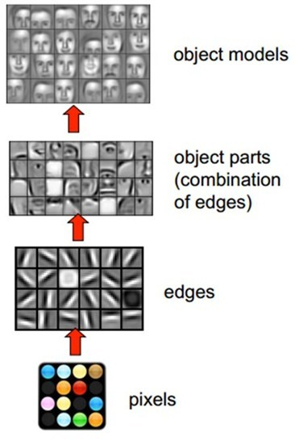

## 目录
> #### 视觉感知
       + 画面识别是什么
       + 识别结果取决于什么
> #### 图像表达
       + 画面识别的输入
       + 画面不变性
> #### 前馈神经网络做画面识别的不足
> #### 卷积神经网络做画面识别
       + 局部连接
       + 空间共享
       + 输出空间表达
       + Depth维的处理
       + Zero padding
       + 形状、概念抓取
       + 多filters
       + 非线性
       + 输出尺寸控制
       + 矩阵乘法执行卷积
       + Max pooling
       + 全连接层
       + 结构发展
> #### 画面不变性的满足
       + 平移不变性
       + 旋转和视角不变性
       + 尺寸不变性
       + Inception的理解
       + 1x1卷积核理解
       + 跳层连接ResNet

## 视觉感知

### 画面识别是什么任务？

学习知识的第一步就是明确任务，清楚该知识的输入输出。卷积神经网络最初是服务于画面识别的，所以我们先来看看画面识别的实质是什么。

先观看几组动物与人类视觉的差异对比图。

1. 苍蝇的视觉和人的视觉的差异

2. 蛇的视觉和人的视觉的差异

通过上面的两组对比图可以知道，即便是相同的图片经过不同的视觉系统，也会得到不同的感知。

这里引出一条知识：生物所看到的景象并非世界的原貌，而是长期进化出来的*适合自己生存环境的一种感知方式*。 蛇的猎物一般是夜间行动，所以它就进化出了一种可以在夜间也能很好观察的感知系统，感热。

任何视觉系统都是将图像反光与脑中所看到的概念进行关联。

所以画面识别实际上并非识别这个东西客观上是什么，而是寻找人类的视觉关联方式，并再次应用。 如果我们不是人类，而是蛇类，那么画面识别所寻找的 就和现在的不一样

> **画面识别实际上是寻找（学习）人类的视觉关联方式 ，并再次应用。**

### 图片被识别成什么取决于哪些因素？

下面用两张图片来体会识别结果取决于哪些因素。

1. 老妇与少女

请观察上面这张图片，你看到的是老妇还是少女？ 以不同的方式去观察这张图片会得出不同的答案。 图片可以观察成有大鼻子、大眼睛的老妇。也可以被观察成少女，但这时老妇的嘴会被识别成少女脖子上的项链，而老妇的眼睛则被识别为少女的耳朵。

2. 海豚与男女

上面这张图片如果是成人观察，多半看到的会是一对亲热的男女。倘若儿童看到这张图片，看到的则会是一群海豚（男女的轮廓是由海豚构造出的）。所以，识别结果受年龄，文化等因素的影响，换句话说：

> **图片被识别成什么不仅仅取决于图片本身，还取决于图片是如何被观察的。**

## 图像表达

我们知道了“画面识别是从大量的(x, y)数据中寻找人类的视觉关联方式 ，并再次应用。 其-是输入，表示所看到的东西-输出，表示该东西是什么。

在自然界中，x是物体的反光，那么在计算机中，图像又是如何被表达和存储的呢？

图像在计算机中是一堆按顺序排列的数字，数值为0到255。0表示最暗，255表示最亮。 你可以把这堆数字用一个长长的向量来表示，也就是tensorflow的mnist教程中784维向量的表示方式。 然而这样会失去平面结构的信息，为保留该结构信息，通常选择矩阵的表示方式：28x28的矩阵。

上图是只有黑白颜色的灰度图，而更普遍的图片表达方式是RGB颜色模型，即红（Red）、绿（Green）、蓝（Blue）三原色的色光以不同的比例相加，以产生多种多样的色光。

这样，RGB颜色模型中，单个矩阵就扩展成了有序排列的三个矩阵，也可以用三维张量去理解，其中的每一个矩阵又叫这个图片的一个channel。

在电脑中，一张图片是数字构成的“长方体”。可用 宽width, 高height, 深depth 来描述，如图。

> **画面识别的输入x是shape为(width, height, depth)的三维张量。**

接下来要考虑的就是该如何处理这样的“数字长方体”。

### 画面不变性

在决定如何处理“数字长方体”之前，需要清楚所建立的网络拥有什么样的特点。 我们知道一个物体不管在画面左侧还是右侧，都会被识别为同一物体，这一特点就是不变性（invariance），如下图所示。

我们希望所建立的网络可以尽可能的满足这些不变性特点。

为了理解卷积神经网络对这些不变性特点的贡献，我们将用不具备这些不变性特点的前馈神经网络来进行比较。

## 图片识别--前馈神经网络

方便起见，我们用depth只有1的灰度图来举例。 想要完成的任务是：在宽长为4x4的图片中识别是否有下图所示的“横折”。 图中，黄色圆点表示值为0的像素，深色圆点表示值为1的像素。 我们知道不管这个横折在图片中的什么位置，都会被认为是相同的横折。

若训练前馈神经网络来完成该任务，那么表达图像的三维张量将会被摊平成一个向量，作为网络的输入，即(width, height, depth)为(4, 4, 1)的图片会被展成维度为16的向量作为网络的输入层。再经过几层不同节点个数的隐藏层，最终输出两个节点，分别表示“有横折的概率”和“没有横折的概率”，如下图所示。

下面我们用数字（16进制）对图片中的每一个像素点（pixel）进行编号。 当使用右侧那种物体位于中间的训练数据来训练网络时，网络就只会对编号为5,6,9,a的节点的权重进行调节。 若让该网络识别位于右下角的“横折”时，则无法识别。

解决办法是用大量物体位于不同位置的数据训练，同时增加网络的隐藏层个数从而扩大网络学习这些变体的能力。

然而这样做十分不效率，因为我们知道在左侧的“横折”也好，还是在右侧的“横折”也罢，大家都是“横折”。 为什么相同的东西在位置变了之后要重新学习？有没有什么方法可以将中间所学到的规律也运用在其他的位置？ 换句话说，也就是**让不同位置用相同的权重**。

## 图片识别--卷积神经网络

卷积神经网络就是让权重在不同位置共享的神经网络。

### 局部连接

在卷积神经网络中，我们先选择一个局部区域，用这个局部区域去扫描整张图片。 局部区域所圈起来的所有节点会被连接到下一层的一个节点上。

为了更好的和前馈神经网络做比较，我将这些以矩阵排列的节点展成了向量。 下图展示了被红色方框所圈中编号为0,1,4,5的节点是如何通过w1, w2, w3, w4连接到下一层的节点0上的。

这个带有连接强弱的红色方框就叫做 **filter** 或 **kernel** 或 **feature detector**。 而filter的范围叫做**filter size**，这里所展示的是2x2的filter size。

第二层的节点0的数值就是局部区域的线性组合，即被圈中节点的数值乘以对应的权重后相加。 用*x*表示输入值，*y*表示输出值，用图中标注数字表示角标，则下面列出了两种计算编号为*y0* 的输出值的表达式。

注：在局部区域的线性组合后，也会和前馈神经网络一样，加上一个偏移量*b0*。

### 空间共享

当filter扫到其他位置计算输出节点*yi* 时，*w1, w2, w3, w4*，包括*b0* 是共用的。

下面这张动态图展示了当filter扫过不同区域时，节点的链接方式。 动态图的最后一帧则显示了所有连接。 可以注意到，每个输出节点并非像前馈神经网络中那样与全部的输入节点连接，而是部分连接。 这也就是为什么大家也叫前馈神经网络（feedforward neural network）为fully-connected neural network。 图中显示的是一步一步的移动filter来扫描全图，一次移动多少叫做stride。

> 空间共享也就是卷积神经网络所引入的先验知识。

### 输出表达

如先前在图像表达中提到的，图片不用向量去表示是为了保留图片平面结构的信息。 同样的，卷积后的输出若用上图的排列方式则丢失了平面结构信息。 所以我们依然用矩阵的方式排列它们，就得到了下图所展示的连接。

这也就是你们在网上所看到的下面这张图。在看这张图的时候请结合上图的连接一起理解，即输入（绿色）的每九个节点连接到输出（粉红色）的一个节点上的。

经过一个feature detector计算后得到的粉红色区域也叫做一个**Convolved Feature** 或 **Activation Map** 或 **Feature Map**。

### Depth维的处理

现在我们已经知道了depth维度只有1的灰度图是如何处理的。 但前文提过，图片的普遍表达方式是下图这样有3个channels的RGB颜色模型。 当depth为复数的时候，每个feature detector是如何卷积的？

**现象**：2x2所表达的filter size中，一个2表示width维上的局部连接数，另一个2表示height维上的局部连接数，并却没有depth维上的局部连接数，是因为depth维上并非局部，而是全部连接的。

下面这张图展示了，在depth为复数时，filter是如何连接输入节点到输出节点的。 图中红、绿、蓝颜色的节点表示3个channels。 黄色节点表示一个feature detector卷积后得到的Feature Map。 其中被透明黑框圈中的12个节点会被连接到黄黑色的节点上。

+ 在输入depth为1时：被filter size为2x2所圈中的4个输入节点连接到1个输出节点上。
+ 在输入depth为3时：被filter size为2x2，但是贯串3个channels后，所圈中的12个输入节点连接到1个输出节点上。
+ 在输入depth为*n*时：2x2x*n*个输入节点连接到1个输出节点上。

**注意**：三个channels的权重并不共享。 即当深度变为3后，权重也跟着扩增到了三组，如式子(3)所示，不同channels用的是自己的权重。 式子中增加的角标r,g,b分别表示red channel, green channel, blue channel的权重。

计算例子：用*xr0* 表示red channel的编号为0的输入节点，*xg5* 表示green channel编号为5个输入节点。*xb1* 表示blue channel。如式子(4)所表达，这时的一个输出节点实际上是12个输入节点的线性组合。

当filter扫到其他位置计算输出节点*yi* 时，那12个权重在不同位置是共用的，如下面的动态图所展示。 透明黑框圈中的12个节点会连接到被白色边框选中的黄色节点上。

> 每个filter会在width维, height维上，以局部连接和空间共享，并贯串整个depth维的方式得到一个Feature Map。

### Zero padding

细心的读者应该早就注意到了，4x4的图片被2x2的filter卷积后变成了3x3的图片，每次卷积后都会小一圈的话，经过若干层后岂不是变的越来越小？ Zero padding就可以在这时帮助控制Feature Map的输出尺寸，同时避免了边缘信息被一步步舍弃的问题。

例如：下面4x4的图片在边缘Zero padding一圈后，再用3x3的filter卷积后，得到的Feature Map尺寸依然是4x4不变。

通常大家都想要在卷积时保持图片的原始尺寸。 选择3x3的filter和1的zero padding，或5x5的filter和2的zero padding可以保持图片的原始尺寸。 这也是为什么大家多选择3x3和5x5的filter的原因。 另一个原因是3x3的filter考虑到了像素与其距离为1以内的所有其他像素的关系，而5x5则是考虑像素与其距离为2以内的所有其他像素的关系。

**尺寸**：Feature Map的尺寸等于(input_size + 2 * padding_size − filter_size)/stride+1。

**注意**：上面的式子是计算width或height一维的。padding_size也表示的是单边补零的个数。例如(4+2-3)/1+1 = 4，保持原尺寸。

不用去背这个式子。其中(input_size + 2 * padding_size)是经过Zero padding扩充后真正要卷积的尺寸。 减去 filter_size后表示可以滑动的范围。 再除以可以一次滑动（stride）多少后得到滑动了多少次，也就意味着得到了多少个输出节点。 再加上第一个不需要滑动也存在的输出节点后就是最后的尺寸。

### 形状、概念抓取

知道了每个filter在做什么之后，我们再来思考这样的一个filter会抓取到什么样的信息。

我们知道不同的形状都可由细小的“零件”组合而成的。比如下图中，用2x2的范围所形成的16种形状可以组合成格式各样的“更大”形状。

卷积的每个filter可以探测特定的形状。又由于Feature Map保持了抓取后的空间结构。若将探测到细小图形的Feature Map作为新的输入再次卷积后，则可以由此探测到“更大”的形状概念。若将探测到细小图形的Feature Map作为新的输入再次卷积后，则可以由此探测到“更大”的形状概念。

除了基础形状之外，颜色、对比度等概念对画面的识别结果也有影响。卷积层也会根据需要去探测特定的概念。

可以从下面这张图中感受到不同数值的filters所卷积过后的Feature Map可以探测边缘，棱角，模糊，突出等概念。

如我们先前所提，图片被识别成什么不仅仅取决于图片本身，还取决于图片是如何被观察的。

而filter内的权重矩阵W是网络根据数据学习得到的，也就是说，我们让神经网络自己学习以什么样的方式去观察图片。

拿老妇与少女的那幅图片举例，当标签是少女时，卷积网络就会学习抓取可以成少女的形状、概念。 当标签是老妇时，卷积网络就会学习抓取可以成老妇的形状、概念。

下图展现了在人脸识别中经过层层的卷积后，所能够探测的形状、概念也变得越来越抽象和复杂。

> 卷积神经网络会尽可能寻找最能解释训练数据的抓取方式。

### 多filters

每个filter可以抓取探测特定的形状的存在。 假如我们要探测下图的长方框形状时，可以用4个filters去探测4个基础“零件”。

因此我们自然而然的会选择用多个不同的filters对同一个图片进行多次抓取。 如下图（动态图过大，如果显示不出，请看到该链接观看），同一个图片，经过两个（红色、绿色）不同的filters扫描过后可得到不同特点的Feature Maps。每增加一个filter，就意味着你想让网络多抓取一个特征。

这样卷积层的输出也不再是depth为1的一个平面，而是和输入一样是depth为复数的长方体。

如下图所示，当我们增加一个filter（紫色表示）后，就又可以得到一个Feature Map。如下图所示，当我们增加一个filter（紫色表示）后，就又可以得到一个Feature Map。

> 卷积层的输入是长方体，输出也是长方体。

这样卷积后输出的长方体可以作为新的输入送入另一个卷积层中处理。

### 加入非线性

和前馈神经网络一样，经过线性组合和偏移后，会加入非线性增强模型的拟合能力。

将卷积所得的Feature Map经过ReLU变换（elementwise）后所得到的output就如下图所展示。

### 输出长方体

现在我们知道了一个卷积层的输出也是一个长方体。 那么这个输出长方体的(width, height, depth)由哪些因素决定和控制。

这里直接用CS231n的Summary：

### 矩阵乘法执行卷积

如果按常规以扫描的方式一步步计算局部节点和filter的权重的点乘，则不能高效的利用GPU的并行能力。 所以更普遍的方法是用两个大矩阵的乘法来一次性囊括所有计算。

因为卷积层的每个输出节点都是由若干个输入节点的线性组合所计算。  因为输出的节点个数是*W2 x H2 x D2*，所以就有*W2 x H2 x D2*个线性组合。

读过我写的线性代数教程的读者请回忆，矩阵乘矩阵的意义可以理解为批量的线性组合按顺序排列。  其中一个矩阵所表示的信息是多组权重，另一个矩阵所表示的信息是需要进行组合的向量。  大家习惯性的把组成成分放在矩阵乘法的右边，而把权重放在矩阵乘法的左边。所以这个大型矩阵乘法可以用*Wrow x Xcol* 表示，其中*Wrow* 和*Xcol* 都是矩阵。

卷积的每个输出是由局部的输入节点和对应的filter权重展成向量后所计算的，如式子(2)。 那么*Wrow* 中的每一行则是每个filter的权重，有*F x F x D1* 个；而*Xcol* 的每一列是所有需要进行组合的节点（上面的动态图中被黑色透明框圈中的节点），也有*F x F x D1* 个。 *Xcol* 的列的个数则表示每个filter要滑动多少次才可以把整个图片扫描完，有*W2 x H2* 次。因为我们有多个filters，*Wrow* 的行的个数则是filter的个数*K*。

最后我们得到：

当然矩阵乘法后需要将*Wrow x Xcol* 整理成形状为*W2 x H2 x D2*的三维张量以供后续处理（如再送入另一个卷积层）。*Xcol* 则也需要逐步的局部滑动图片，最后堆叠构成用于计算矩阵乘法的形式。

### Max pooling

在卷积后还会有一个pooling的操作，尽管有其他的比如average pooling等，这里只提max pooling。

max pooling的操作如下图所示：整个图片被不重叠的分割成若干个同样大小的小块（pooling size）。每个小块内只取最大的数字，再舍弃其他节点后，保持原有的平面结构得出output。

max pooling在不同的depth上是分开执行的，且不需要参数控制。  那么问题就max pooling有什么作用？部分信息被舍弃后难道没有影响吗？

Max pooling的主要功能是downsampling，却不会损坏识别结果。这意味着卷积后的Feature Map中有对于识别物体不必要的冗余信息。 那么我们就反过来思考，这些**冗余**信息是如何产生的。

直觉上，我们为了探测到某个特定形状的存在，用一个filter对整个图片进行逐步扫描。但只有出现了该特定形状的区域所卷积获得的输出才是真正有用的，用该filter卷积其他区域得出的数值就可能对该形状是否存在的判定影响较小。比如下图中，我们还是考虑探测“横折”这个形状。 卷积后得到3x3的Feature Map中，真正有用的就是数字为3的那个节点，其余数值对于这个任务而言都是无关的。 所以用3x3的Max pooling后，并没有对“横折”的探测产生影响。 试想在这里例子中如果不使用Max pooling，而让网络自己去学习。 网络也会去学习与Max pooling近似效果的权重。因为是近似效果，增加了更多的parameters的代价，却还不如直接进行Max pooling。

Max pooling还有类似“选择句”的功能。假如有两个节点，其中第一个节点会在某些输入情况下最大，那么网络就只在这个节点上流通信息；而另一些输入又会让第二个节点的值最大，那么网络就转而走这个节点的分支。

但是Max pooling也有不好的地方。因为并非所有的抓取都像上图的极端例子。有些周边信息对某个概念是否存在的判定也有影响。 并且Max pooling是对所有的Feature Maps进行等价的操作。就好比用相同网孔的渔网打鱼，一定会有漏网之鱼。

### 全连接层

当抓取到足以用来识别图片的特征后，接下来的就是如何进行分类。全连接层（也叫前馈层）就可以用来将最后的输出映射到线性可分的空间。 通常卷积网络的最后会将末端得到的长方体平摊(flatten)成一个长长的向量，并送入全连接层配合输出层进行分类。

卷积神经网络大致就是covolutional layer, pooling layer, ReLu layer, fully-connected layer的组合，例如下图所示的结构。

这里也体现了深层神经网络或deep learning之所以称deep的一个原因：模型将特征抓取层和分类层合在了一起。 负责特征抓取的卷积层主要是用来学习“如何观察”。

下图简述了机器学习的发展，从最初的人工定义特征再放入分类器的方法，到让机器自己学习特征，再到如今尽量减少人为干涉的deep learning。

### 结构发展

以上介绍了卷积神经网络的基本概念。 以下是几个比较有名的卷积神经网络结构，详细的请看CS231n。

+ *LeNet*：第一个成功的卷积神经网络应用
+ *AlexNet*：AlexNet类似LeNet，但更深更大。使用了层叠的卷积层来抓取特征（通常是一个卷积层马上一个max pooling层）
+ *ZF Net*：增加了中间卷积层的尺寸，让第一层的stride和filter size更小。
+ *GoogLeNet*：减少parameters数量，最后一层用max pooling层代替了全连接层，更重要的是Inception-v4模块的使用。
+ *VGGNet*：第只使用3x3 卷积层和2x2 pooling层从头到尾堆叠。
+ *ResNet*：引入了跨层连接和batch normalization。
+ *DenseNet*：将跨层连接从头进行到尾。

总结一下：这些结构的发展趋势有：

+ 使用small filter size的卷积层和pooling
+ 去掉parameters过多的全连接层
+ Inception（稍后会对其中的细节进行说明）
+ 跳层连接

## 不变性的满足

接下来会谈谈我个人的，对于画面不变性是如何被卷积神经网络满足的想法。 同时结合不变性，对上面提到的结构发展的重要变动进行直觉上的解读。

需要明白的是为什么加入不变性可以提高网络表现。 并不是因为我们用了更炫酷的处理方式，而是加入了先验知识，无需从零开始用数据学习，节省了训练所需数据量。 思考表现提高的原因一定要从训练所需要的数据量切入。提出满足新的不变性特点的神经网络是计算机视觉的一个主要研究方向。

### 平移不变性

可以说卷积神经网络最初引入局部连接和空间共享，就是为了满足平移不变性。

因为空间共享，在不同位置的同一形状就可以被等价识别，所以不需要对每个位置都进行学习。

### 旋转和视角不变性

个人觉得卷积神经网络克服这一不变性的主要手段还是靠大量的数据。并没有明确加入“旋转和视角不变性”的先验特性。

Deformable Convolutional Networks似乎是对此变性进行了进行增强。

### 尺寸不变性

与平移不变性不同，最初的卷积网络并没有明确照顾尺寸不变性这一特点。

我们知道filter的size是事先选择的，而不同的尺寸所寻找的形状（概念）范围不同。

从直观上思考，如果选择小范围，再一步步通过组合，仍然是可以得到大范围的形状。 如3x3尺寸的形状都是可以由2x2形状的图形组合而成。所以形状的尺寸不变性对卷积神经网络而言并不算问题。 这恐怕ZF Net让第一层的stride和filter size更小，VGGNet将所有filter size都设置成3x3仍可以得到优秀结果的一个原因。

但是，除了形状之外，很多概念的抓取通常需要考虑一个像素与周边更多像素之间的关系后得出。也就是说5x5的filter也是有它的优点。 同时，小尺寸的堆叠需要很多个filters来共同完成，如果需要抓取的形状恰巧在5x5的范围，那么5x5会比3x3来的更有效率。 所以一次性使用多个不同filter size来抓取多个范围不同的概念是一种顺理成章的想法，而这个也就是Inception。 可以说Inception是为了尺寸不变性而引入的一个先验知识。

### Inception

下图是Inception的结构，尽管也有不同的版本，但是其动机都是一样的：消除尺寸对于识别结果的影响，一次性使用多个不同filter size来抓取多个范围不同的概念，并让网络自己选择需要的特征。

你也一定注意到了蓝色的1x1卷积，撇开它，先看左边的这个结构。

输入（可以是被卷积完的长方体输出作为该层的输入）进来后，通常我们可以选择直接使用像素信息(1x1卷积)传递到下一层，可以选择3x3卷积，可以选择5x5卷积，还可以选择max pooling的方式downsample刚被卷积后的feature maps。 但在实际的网络设计中，究竟该如何选择需要大量的实验和经验的。 Inception就不用我们来选择，而是将4个选项给神经网络，让网络自己去选择最合适的解决方案。

接下来我们再看右边的这个结构，多了很多蓝色的1x1卷积。这些1x1卷积的作用是为了让网络根据需要能够更灵活的控制数据的depth的。

### 1x1卷积核

如果卷积的输出输入都只是一个平面，那么1x1卷积核并没有什么意义，它是完全不考虑像素与周边其他像素关系。 但卷积的输出输入是长方体，所以1x1卷积实际上是对每个像素点，在不同的channels上进行线性组合（信息整合），且保留了图片的原有平面结构，调控depth，从而完成升维或降维的功能。

如下图所示，如果选择2个filters的1x1卷积层，那么数据就从原本的depth 3 降到了2。若用4个filters，则起到了升维的作用。

这就是为什么前面Inception的4个选择中都混合一个1x1卷积，如右侧所展示的那样。 其中，绿色的1x1卷积本身就1x1卷积，所以不需要再用另一个1x1卷积。 而max pooling用来去掉卷积得到的Feature Map中的冗余信息，所以出现在1x1卷积之前，紧随刚被卷积后的feature maps。（由于没做过实验，不清楚调换顺序会有什么影响。）

### 跳层连接

前馈神经网络也好，卷积神经网络也好，都是一层一层逐步变换的，不允许跳层组合。 但现实中是否有跳层组合的现象？

比如说我们在判断一个人的时候，很多时候我们并不是观察它的全部，或者给你的图片本身就是残缺的。 这时我们会靠单个五官，外加这个人的着装，再加他的身形来综合判断这个人，如下图所示。 这样，即便图片本身是残缺的也可以很好的判断它是什么。这和前馈神经网络的先验知识不同，它允许不同层级之间的因素进行信息交互、综合判断。

残差网络就是拥有这种特点的神经网络。大家喜欢用identity mappings去解释为什么残差网络更优秀。 这里我只是提供了一个以先验知识的角度去理解的方式。 需要注意的是每一层并不会像我这里所展示的那样，会形成明确的五官层。 只是有这样的组合趋势，实际无法保证神经网络到底学到了什么内容。

用下图举一个更易思考的例子。 图形1,2,3,4,5,6是第一层卷积层抓取到的概念。用下图举一个更易思考的例子。 图形1,2,3,4,5,6是第一层卷积层抓取到的概念。

但当我们想要探测的图形10并不是单纯的靠图形7,8,9组成，而是第一个卷积层的图形6和第二个卷积层的8,9组成的话，不允许跨层连接的卷积网络不得不用更多的filter来保持第一层已经抓取到的图形信息。并且每次传递到下一层都需要学习那个用于保留前一层图形概念的filter的权重。当层数变深后，会越来越难以保持，还需要max pooling将冗余信息去掉。

一个合理的做法就是直接将上一层所抓取的概念也跳层传递给下下一层，不用让其每次都重新学习。 就好比在编程时构建了不同规模的functions。 每个function我们都是保留，而不是重新再写一遍。提高了重用性。

同时，因为ResNet使用了跳层连接的方式。也不需要max pooling对保留低层信息时所产生的冗余信息进行去除。

Inception中的第一个1x1的卷积通道也有类似的作用，但是1x1的卷积仍有权重需要学习。 并且Inception所使用的结合方式是concatenate的合并成一个更大的向量的方式，而ResNet的结合方式是sum。 两个结合方式各有优点。 concatenate当需要用不同的维度去组合成新观念的时候更有益。 而sum则更适用于并存的判断。比如既有油头发，又有胖身躯，同时穿着常年不洗的牛仔裤，三个不同层面的概念并存时，该人会被判定为程序员的情况。 又比如双向LSTM中正向和逆向序列抓取的结合常用相加的方式结合。在语音识别中，这表示既可以正向抓取某种特征，又可以反向抓取另一种特征。当两种特征同时存在时才会被识别成某个特定声音。

在下图的ResNet中，前一层的输入会跳过部分卷积层，将底层信息传递到高层。

在下图的DenseNet中，底层信息会被传递到所有的后续高层。

## 后续

随着时间推移，各个ResNet,GoogLeNet等框架也都在原有的基础上进行了发展和改进。 但基本都是上文描述的概念的组合使用加上其他的tricks。

如下图所展示的，加入跳层连接的Inception-ResNet。

但对我而言，

> 真正重要的是这些技巧对于各种不变性的满足。