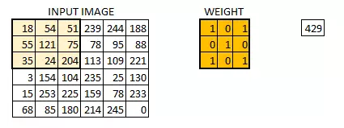
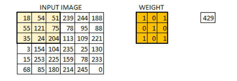
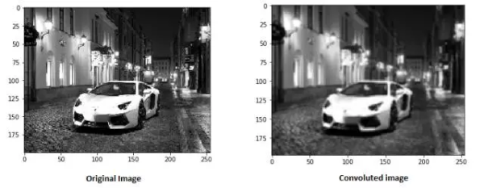
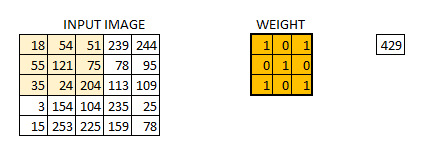
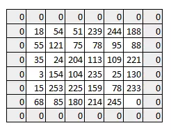
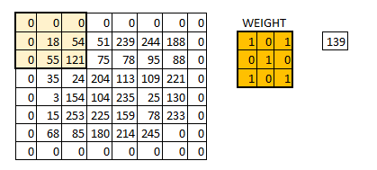
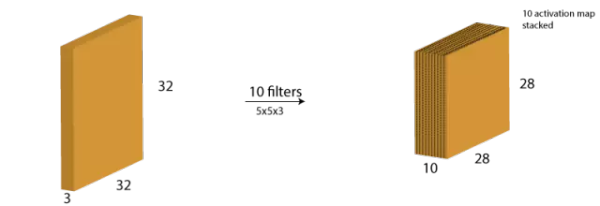
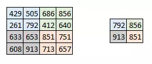
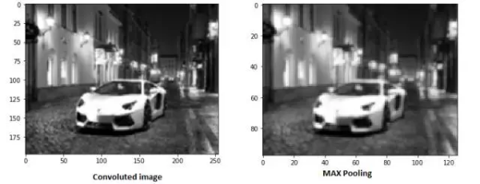
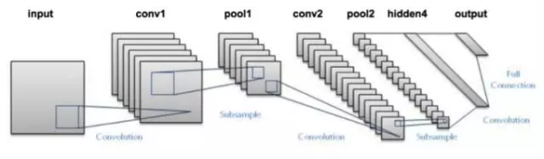

在本文中，我将会讨论 CNN 背后的架构，其设计初衷在于解决图像识别和分类问题。同时我也会假设你对神经网络已经有了初步了解。

## 卷积层

在这一层中，实际所发生的就像我们在上述案例 5 中见到的一样。假设我们有一个 6*6 的图像。我们定义一个权值矩阵，用来从图像中提取一定的特征。

我们把权值初始化成一个 3 * 3 的矩阵。这个权值现在应该与图像结合，所有的像素都被覆盖至少一次，从而来产生一个卷积化的输出。上述的 429，是通过计算权值矩阵和输入图像的 3 * 3 高亮部分以元素方式进行的乘积的值而得到的。

现在 6 * 6 的图像转换成了 4 * 4 的图像。想象一下权值矩阵就像用来刷墙的刷子。首先在水平方向上用这个刷子进行刷墙，然后再向下移，对下一行进行水平粉刷。当权值矩阵沿着图像移动的时候，像素值再一次被使用。实际上，这样可以使参数在卷积神经网络中被共享。

下面我们以一个真实图像为例。

权值矩阵在图像里表现的像一个从原始图像矩阵中提取特定信息的过滤器。一个权值组合可能用来提取边缘（edge）信息，另一个可能是用来提取一个特定颜色，下一个就可能就是对不需要的噪点进行模糊化。

先对权值进行学习，然后损失函数可以被最小化，类似于多层感知机（MLP）。因此需要通过对参数进行学习来从原始图像中提取信息，从而来帮助网络进行正确的预测。当我们有多个卷积层的时候，初始层往往提取较多的一般特征，随着网络结构变得更深，权值矩阵提取的特征越来越复杂，并且越来越适用于眼前的问题。

### 步长（stride）和边界（padding）的概念

像我们在上面看到的一样，过滤器或者说权值矩阵，在整个图像范围内一次移动一个像素。我们可以把它定义成一个超参数（hyperparameter），从而来表示我们想让权值矩阵在图像内如何移动。如果权值矩阵一次移动一个像素，我们称其步长为 1。下面我们看一下步长为 2 时的情况。

你可以看见当我们增加步长值的时候，图像的规格持续变小。在输入图像四周填充 0 边界可以解决这个问题。我们也可以在高步长值的情况下在图像四周填加不只一层的 0 边界。

我们可以看见在我们给图像填加一层 0 边界后，图像的原始形状是如何被保持的。由于输出图像和输入图像是大小相同的，所以这被称为 same padding。

这就是 same padding（意味着我们仅考虑输入图像的有效像素）。中间的 4*4 像素是相同的。这里我们已经利用边界保留了更多信息，并且也已经保留了图像的原大小。

### 多过滤与激活图

需要记住的是权值的纵深维度（depth dimension）和输入图像的纵深维度是相同的。权值会延伸到输入图像的整个深度。因此，和一个单一权值矩阵进行卷积会产生一个单一纵深维度的卷积化输出。大多数情况下都不使用单一过滤器（权值矩阵），而是应用维度相同的多个过滤器。

每一个过滤器的输出被堆叠在一起，形成卷积图像的纵深维度。假设我们有一个 32 * 32 * 3 的输入。我们使用 5 * 5 * 3，带有 valid padding 的 10 个过滤器。输出的维度将会是 28 * 8 * 10。

如下图所示：

激活图是卷积层的输出。

## 池化层
有时图像太大，我们需要减少训练参数的数量，它被要求在随后的卷积层之间周期性地引进池化层。池化的唯一目的是减少图像的空间大小。池化在每一个纵深维度上独自完成，因此图像的纵深保持不变。池化层的最常见形式是最大池化。

在这里，我们把步幅定为 2，池化尺寸也为 2。最大化执行也应用在每个卷机输出的深度尺寸中。正如你所看到的，最大池化操作后，4 * 4 卷积的输出变成了 2 * 2。

让我们看看最大池化在真实图片中的效果如何。

正如你看到的，我们卷积了图像，并最大池化了它。最大池化图像仍然保留了汽车在街上的信息。如果你仔细观察的话，你会发现图像的尺寸已经减半。这可以很大程度上减少参数。

同样，其他形式的池化也可以在系统中应用，如平均池化和 L2 规范池化。

## 输出维度

理解每个卷积层输入和输出的尺寸可能会有点难度。以下三点或许可以让你了解输出尺寸的问题。有三个超参数可以控制输出卷的大小。

1. 过滤器数量-输出卷的深度与过滤器的数量成正比。请记住该如何堆叠每个过滤器的输出以形成激活映射。激活图的深度等于过滤器的数量。
2. 步幅（Stride）-如果步幅是 1，那么我们处理图片的精细度就进入单像素级别了。更高的步幅意味着同时处理更多的像素，从而产生较小的输出量。
3. 零填充（zero padding）-这有助于我们保留输入图像的尺寸。如果添加了单零填充，则单步幅过滤器的运动会保持在原图尺寸。

我们可以应用一个简单的公式来计算输出尺寸。输出图像的空间尺寸可以计算为（[W-F + 2P] / S）+1。在这里，W 是输入尺寸，F 是过滤器的尺寸，P 是填充数量，S 是步幅数字。假如我们有一张 32 * 32 * 3 的输入图像，我们使用 10 个尺寸为 3 * 3 * 3 的过滤器，单步幅和零填充。

那么 W=32，F=3，P=0，S=1。输出深度等于应用的滤波器的数量，即 10，输出尺寸大小为 ([32-3+0]/1)+1 = 30。因此输出尺寸是 30 * 30 * 10。

### 输出层

在多层卷积和填充后，我们需要以类的形式输出。卷积和池化层只会提取特征，并减少原始图像带来的参数。然而，为了生成最终的输出，我们需要应用全连接层来生成一个等于我们需要的类的数量的输出。仅仅依靠卷积层是难以达到这个要求的。卷积层可以生成 3D 激活图，而我们只需要图像是否属于一个特定的类这样的内容。输出层具有类似分类交叉熵的损失函数，用于计算预测误差。一旦前向传播完成，反向传播就会开始更新权重与偏差，以减少误差和损失。

## 小结

正如你所看到的，CNN 由不同的卷积层和池化层组成。让我们看看整个网络是什么样子：

+ 我们将输入图像传递到第一个卷积层中，卷积后以激活图形式输出。图片在卷积层中过滤后的特征会被输出，并传递下去。
+ 每个过滤器都会给出不同的特征，以帮助进行正确的类预测。因为我们需要保证图像大小的一致，所以我们使用同样的填充（零填充），否则填充会被使用，因为它可以帮助减少特征的数量。
+ 随后加入池化层进一步减少参数的数量。
+ 在预测最终提出前，数据会经过多个卷积和池化层的处理。卷积层会帮助提取特征，越深的卷积神经网络会提取越具体的特征，越浅的网络提取越浅显的特征。
+ 如前所述，CNN 中的输出层是全连接层，其中来自其他层的输入在这里被平化和发送，以便将输出转换为网络所需的参数。
+ 随后输出层会产生输出，这些信息会互相比较排除错误。损失函数是全连接输出层计算的均方根损失。随后我们会计算梯度错误。
+ 错误会进行反向传播，以不断改进过滤器（权重）和偏差值。
+ 一个训练周期由单次正向和反向传递完成。